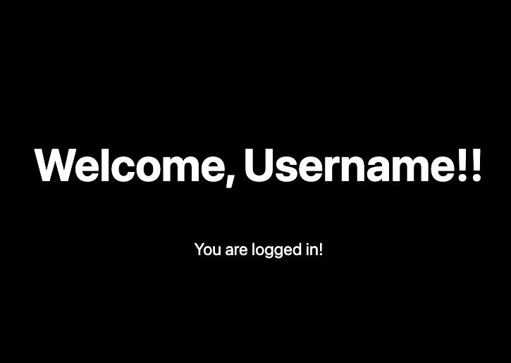

# OAuth Frontend Example

This is a minimal frontend server for backend developer to practice implementing OAuth 2.0 flow.

## Installation

Install [node] and [yarn] if you haven't yet.

```bash
brew install node

npm install --global yarn
```

Install dependencies.

```bash
yarn
```

Run the development server:

```bash
yarn dev
```

Open [http://localhost:3000](http://localhost:3000) with your browser to see the result.

## Your Task

Your task is to implement a OAuth2.0 backend server. 

User should be able to access the site, and login if not already logged in.

### Technical Details

There are two pages in this site, one is homepage `/` and one is login page `/login`.

When user visits the homepage, it tries to call backend (`http://0.0.0.0:8000/users/me`) with the cookie.

Backend should check the cookie to authenticate the user and return a json response with a 'nickname' key.

If the server returns 403, user is redirected to login page, with a button linking to `http://0.0.0.0:8000/login`.

Note the difference in `localhost` and `0.0.0.0`. This is to simulate the production environment where frontend and backend domain might be different.

### Success Page

